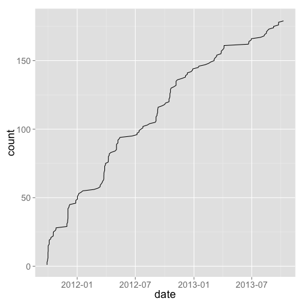
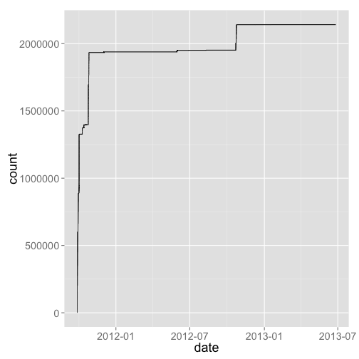
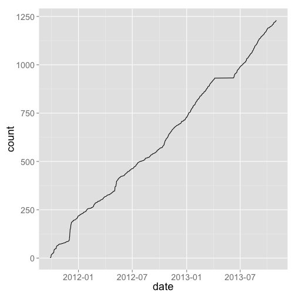
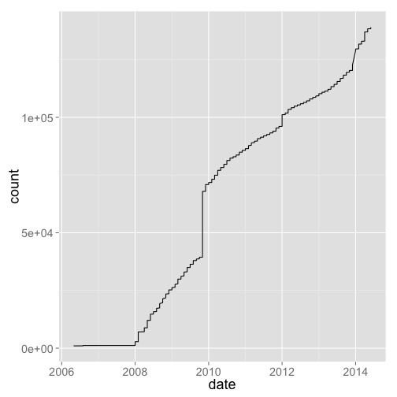
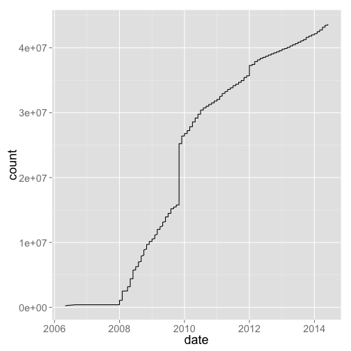
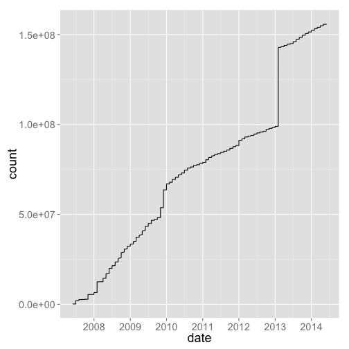
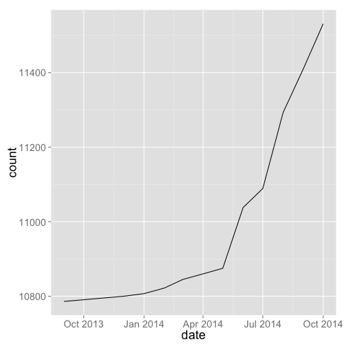
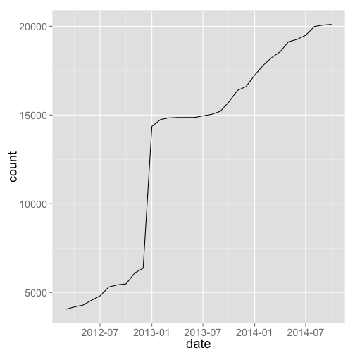

dbgrowth analysis
=================

## Get data

### Local files

Read in files


```r
library('data.table')

dryad <- read.table("data/dryadSubmitDates.txt", col.names = 'submitdate', stringsAsFactors = FALSE)
bef <- read.table("data/BEF_Datalast_modified_dump.csv", header = TRUE, sep = ",")
npn <- read.table("data/records_per_month.csv", header = TRUE, sep = ",")
treebase <- read.table("data/treebase.csv", header = TRUE, sep = ",")
itis <- read.table("data/itis.csv", header = TRUE, sep = ",", stringsAsFactors = FALSE)
ebird_checklist <- read.table("data/ebird_checklist_submissions.csv", header = TRUE, sep = ",", stringsAsFactors = FALSE)
ebird_observations <- read.table("data/ebird_observations.csv", header = TRUE, sep = ",", stringsAsFactors = FALSE)
col <- read.table("data/col.csv", header = TRUE, sep = ",")
opensnp_snps <- data.frame(fread("data/opensnp_data/snps.txt"))
opensnp_users <- read.table("data/opensnp_data/users.txt", header = FALSE, sep = "\t")
opensnp_genotypes <- read.table("data/opensnp_data/genotypes.txt", header = FALSE, sep = "\t")
opensnp_phenotypes <- read.table("data/opensnp_data/phenotypes.txt", header = FALSE, sep = "\t")
bhl_titles <- read.delim("data/bhl_titles.csv", header = TRUE, sep = ",")
bhl_items <- read.delim("data/bhl_items.csv", header = TRUE, sep = ",")
bhl_names <- read.delim("data/bhl_names.csv", header = TRUE, sep = ",")
bhl_pages <- read.delim("data/bhl_pages.csv", header = TRUE, sep = ",")
gbif_data <- read.delim("data/gbif_data.csv", header = FALSE, sep = ",", stringsAsFactors=FALSE)
gbif_publishers <- read.delim("data/gbif_publishers.csv", header = FALSE, sep = ",", stringsAsFactors=FALSE)
dcite <- read.csv('data/datacite.csv')
```

### Neotoma data

From email: 

>  You'll note a huge jump in taxa in January 2013, when taxa from the Diatom Paleolimnology Data Cooperative and the FAUNMAP 2 database were added. 


```r
library('httr')
url_taxa <- 'https://tilia.neotomadb.org/Retrieve/?method=GetTableRecordCountsByMonth&TABLENAME=Taxa'
url_datasets <- 'https://tilia.neotomadb.org/Retrieve/?method=GetTableRecordCountsByMonth&TABLENAME=Datasets'
url_data <- 'https://tilia.neotomadb.org/Retrieve/?method=GetTableRecordCountsByMonth&TABLENAME=Data'

neotoma_taxa <- jsonlite::fromJSON(content(GET(url_taxa), "text"))$data
neotoma_datasets <- jsonlite::fromJSON(content(GET(url_datasets), "text"))$data
neotoma_data <- jsonlite::fromJSON(content(GET(url_data), "text"))$data
```

### Theplantlist.org data

This url [http://www.theplantlist.org/1.1/statistics/]() has some stats, but no growth through time

__Ignoring then...__

### dbSNP data


```r
library('httr')
library('XML')
library('plyr')
library('lubridate')
url <- 'http://www.ncbi.nlm.nih.gov/projects/SNP/snp_summary.cgi?view+summary=view+summary&build_id=%s'
build_ids <- 106:141
get_dbsnp_data <- function(x){
  res <- GET(sprintf(url, x))
  tables <- readHTMLTable(sprintf(url, x))
  names(tables) <- NULL
  use <- 
    compact(lapply(tables, function(x){
      tbn <- names(x)
      if(all(c("Organism","dbSNPBuild","GenomeBuild") %in% tbn)) x else NULL
    }))[[1]]
  names(use) <- c("organism","dbsnpbuild","genomebuild",'no_sub','no_refsnpclusters','no_refsnpingene','no_subswithgenotype','no_subswithfreq')
  use
}
dbsnpdat <- lapply(build_ids, get_dbsnp_data)
names(dbsnpdat) <- build_ids
dbsnpdat_df <- ldply(dbsnpdat)
head(dbsnpdat_df)
```

```
##   .id           organism dbsnpbuild genomebuild no_sub no_refsnpclusters
## 1 106  Total:  Organisms               0genomes                       ()
## 2 107        Glycine max        107                281         278 (278)
## 3 107 Total: 1 Organisms               0genomes    281         278 (278)
## 4 108  Total:  Organisms               0genomes                       ()
## 5 109  Total:  Organisms               0genomes                       ()
## 6 110  Total:  Organisms               0genomes                       ()
##   no_refsnpingene no_subswithgenotype no_subswithfreq
## 1                                                    
## 2                                 281                
## 3                                 281                
## 4                                                    
## 5                                                    
## 6
```

```r
vals <- as.character(dbsnpdat_df[ grepl("Total:", dbsnpdat_df$organism), "no_sub" ])
vals <- as.numeric(gsub(",", "", vals))

get_dbsnp_dates <- function(x){
  res <- GET(sprintf(url, x))
  tables <- readHTMLTable(sprintf(url, x))
  names(tables) <- NULL
  year(mdy(na.omit(as.character(compact(lapply(tables, function(x){
      tbn <- names(x)
      if(all(c("Component","Date available") %in% tbn)) x else NULL
  }))[[1]]$`Date available`)))[1])
}
yrs <- vapply(build_ids, get_dbsnp_dates, numeric(1))

dbsnp_all <- data.frame(year=yrs, count=vals, stringsAsFactors = FALSE)
```

### Dryad data

We got some data in a `csv` file via email in October 2013, but it's been a year now, so...

> Skipping this for now, just use csv file, as can't figure out what are unique datasets.


## Data viz/analysis


```r
library('dplyr')
# datasets <- list(dryad, bef, npn, treebase, itis, ebird_checklist, ebird_observations, col, opensnp_snps, opensnp_users,opensnp_genotypes, opensnp_phenotypes, bhl_titles, bhl_items, bhl_names, bhl_pages, gbif_data, gbif_publishers, dcite,neotoma_taxa,neotoma_datasets,neotoma_data,dbsnp_all)

datasets2 <- c('dryad', 'bef', 'npn', 'treebase', 'itis', 'ebird_checklist', 'ebird_observations', 'col', 'opensnp_snps', 'opensnp_users','opensnp_genotypes', 'opensnp_phenotypes', 'bhl_titles', 'bhl_items', 'bhl_names', 'bhl_pages', 'gbif_data', 'gbif_publishers', 'dcite', 'neotoma_taxa', 'neotoma_datasets', 'neotoma_data', 'dbsnp_all')
```

### Size of open data


```r
calc <- function(x, func=NULL) func(eval(parse(text = x)))
res <- ldply(sapply(datasets2, calc, func=NROW))
names(res) <- c("source","value")
res
```

```
##                source   value
## 1               dryad    4186
## 2                 bef      66
## 3                 npn      56
## 4            treebase      33
## 5                itis      37
## 6     ebird_checklist     142
## 7  ebird_observations      79
## 8                 col      13
## 9        opensnp_snps 2140939
## 10      opensnp_users    1230
## 11  opensnp_genotypes     589
## 12 opensnp_phenotypes     179
## 13         bhl_titles    1485
## 14          bhl_items    1619
## 15          bhl_names    2920
## 16          bhl_pages    1624
## 17          gbif_data      39
## 18    gbif_publishers      47
## 19              dcite 1000000
## 20       neotoma_taxa      31
## 21   neotoma_datasets      12
## 22       neotoma_data      12
## 23          dbsnp_all      36
```

### Growth in open data

First, we have to convert all the date-like fields to proper date classes. 

Some functions


```r
add0 <- function(x) if(nchar(x) == 1) paste0("0", x) else x
yr_mo <- function(x){
  x <- x[ !x$Year == 0, ]
  x$date <- ymd(apply(x, 1, function(y) paste(y['Year'], add0(y['Month']), "01", sep = "-")))
  x
}
```

The conversions


```r
dryad$date <- ymd_hms(dryad$submitdate)
bef$date <- ymd_hms(bef$last.modified)
npn$date <- ymd(apply(npn, 1, function(x) paste(x['year'], x['month'], "01", sep = "-")))
treebase$date <- ymd(paste0(treebase$Year, "01-01"))
itis$date <- myd(sapply(itis$date, function(y) paste0(y, "-01")))
ebird_observations$date <- as.Date(sapply(ebird_observations[,2], function(x) paste0(paste0(strsplit(x, "/")[[1]], collapse = "-"), "-01")))
col$date <- ymd(paste0(col$year, "-01-01"))
opensnp_snps$date <- dmy_hm(gsub("\\.", "-", opensnp_snps[,2]))
opensnp_users$date <- dmy_hm(gsub("\\.", "-", opensnp_users[,2]))
opensnp_genotypes$date <- dmy_hm(gsub("\\.", "-", opensnp_genotypes[,2]))
opensnp_phenotypes$date <- dmy_hm(gsub("\\.", "-", opensnp_phenotypes[,2]))
bhl_titles <- yr_mo(bhl_titles)
bhl_items <- yr_mo(bhl_items)
bhl_names <- yr_mo(bhl_names)
bhl_pages <- yr_mo(bhl_pages)
gbif_data$date <- ymd(gbif_data$V1)
gbif_publishers$date <- ymd(gbif_publishers$V1)
dcite$date <- ymd_hms(dcite$uploaded)
neotoma_taxa <- yr_mo(neotoma_taxa)
neotoma_datasets <- yr_mo(neotoma_datasets)
neotoma_data <- yr_mo(neotoma_data)
dbsnp_all$date <- ymd(paste0(dbsnp_all$year, "01-01"))
```

Visualize, counts by date


```r
sort_count <- function(x){
  x %>%
    arrange(date) %>%
    mutate(count = 1:n())
}

gp <- function(x){
  ggplot(x, aes(date, count)) + 
  geom_line() + 
  theme_grey(base_size = 18)
}
```

Dryad 


```r
dryad %>% sort_count %>% gp
```

 

BEF 


```r
bef %>% sort_count %>% gp
```

 

OpenSNP


```r
opensnp_genotypes %>% sort_count %>% gp
```

 

```r
opensnp_phenotypes %>% sort_count %>% gp
```

 

```r
opensnp_snps %>% sort_count %>% gp
```

 

```r
opensnp_users %>% sort_count %>% gp
```

 

Datacite


```r
dcite %>% sort_count %>% gp
```

 

Visualize, counts summarised previously

US National Phenology Network


```r
npn %>% arrange(date) %>% rename(count = Number_Records) %>% gp
```

 

TreeBASE


```r
treebase %>% arrange(date) %>% rename(count = New.Trees.Added) %>% gp
```

 

ITIS


```r
itis %>% arrange(date) %>% rename(count = total_names) %>% gp
```

 

eBird


```r
ebird_observations %>% arrange(date) %>% rename(count = COUNT.OBS_ID.) %>% gp
```

 

Catalogue of Life


```r
col %>% arrange(date) %>% rename(count = species) %>% gp
```

 

```r
col %>% arrange(date) %>% rename(count = source_databases) %>% gp
```

 

Biodiversity Heritage Library


```r
bhl_titles %>% 
  arrange(date) %>% 
  mutate(count = cumsum(Titles)) %>%
  gp
```

 

```r
bhl_items %>% 
  arrange(date) %>% 
  mutate(count = cumsum(Items)) %>%
  gp
```

 

```r
bhl_pages %>% 
  arrange(date) %>% 
  mutate(count = cumsum(Pages)) %>%
  gp
```

 

```r
bhl_names %>% 
  arrange(date) %>% 
  mutate(count = cumsum(Names)) %>%
  gp
```

 

GBIF


```r
gbif_data %>%
  arrange(date) %>%
  rename(count = V2) %>%
  gp + labs(y="Millions of biodiversity records in GBIF")
```

 

```r
gbif_publishers %>%
  arrange(date) %>%
  rename(count = V2) %>%
  gp + labs(y="Number of GBIF data publishers")
```

 

Neotoma


```r
neotoma_data %>%
  arrange(date) %>%
  rename(count = RunningCount) %>%
  gp
```

 

```r
neotoma_datasets %>%
  arrange(date) %>%
  rename(count = RunningCount) %>%
  gp
```

 

```r
neotoma_taxa %>%
  arrange(date) %>%
  rename(count = RunningCount) %>%
  gp
```

 

### Gaps in open data

This is more of a qualitative judgment, but ...

### Reproduce this

* Option 1: If you are comfortable with git, simply clone the [dbgrowth repository](https://github.com/ropensci/dbgrowth) to your machine, uncompress the compressed file, `cd` to the directory, and run `R`. Running R should enter _packrat mode_, which will install packages from within the directory, after which point you can reproduce what we have done above.
* Option 2: Install the `packrat` R package if you don't have it already. Download the compressed file (a _packrat bundle_), then in R, run `packrat::unbundle("<path to tar.gz>", "<path to put the contents>")`, which will uncompress the file, and install packages, and you're ready to go.
