dbgrowth analysis
=================


## Get data

Load packages


```r
library('data.table')
library('httr')
library('httr')
library('XML')
library('plyr')
library('lubridate')
library('ggplot2')
library('knitr')
library('dplyr')
```

Read in local files


```r
dryad <- read.table("data/dryadSubmitDates.txt", col.names = 'submitdate', stringsAsFactors = FALSE)
bef <- read.table("data/BEF_Datalast_modified_dump.csv", header = TRUE, sep = ",")
npn <- read.table("data/records_per_month.csv", header = TRUE, sep = ",")
treebase <- read.table("data/treebase.csv", header = TRUE, sep = ",")
itis <- read.table("data/itis.csv", header = TRUE, sep = ",", stringsAsFactors = FALSE)
ebird_checklist <- read.table("data/ebird_checklist_submissions.csv", header = TRUE, sep = ",", stringsAsFactors = FALSE)
ebird_observations <- read.table("data/ebird_observations.csv", header = TRUE, sep = ",", stringsAsFactors = FALSE)
col <- read.table("data/col.csv", header = TRUE, sep = ",")
opensnp_snps <- data.frame(fread("data/opensnp_data/snps.txt"))
opensnp_users <- read.table("data/opensnp_data/users.txt", header = FALSE, sep = "\t")
opensnp_genotypes <- read.table("data/opensnp_data/genotypes.txt", header = FALSE, sep = "\t")
opensnp_phenotypes <- read.table("data/opensnp_data/phenotypes.txt", header = FALSE, sep = "\t")
bhl_titles <- read.delim("data/bhl_titles.csv", header = TRUE, sep = ",")
bhl_items <- read.delim("data/bhl_items.csv", header = TRUE, sep = ",")
bhl_names <- read.delim("data/bhl_names.csv", header = TRUE, sep = ",")
bhl_pages <- read.delim("data/bhl_pages.csv", header = TRUE, sep = ",")
gbif_data <- read.delim("data/gbif_data.csv", header = FALSE, sep = ",", stringsAsFactors=FALSE)
gbif_publishers <- read.delim("data/gbif_publishers.csv", header = FALSE, sep = ",", stringsAsFactors=FALSE)
dcite <- read.csv('data/datacite.csv')
```

Collect data from Neotoma and dbSNP. Executed and read in without echoing code.


Define vector of dataset names


```r
datasets2 <- c('dryad', 'bef', 'npn', 'treebase', 'itis', 'ebird_checklist', 'ebird_observations', 'col', 'opensnp_snps', 'opensnp_users','opensnp_genotypes', 'opensnp_phenotypes', 'bhl_titles', 'bhl_items', 'bhl_names', 'bhl_pages', 'gbif_data', 'gbif_publishers', 'dcite', 'neotoma_taxa', 'neotoma_datasets', 'neotoma_data', 'dbsnp_all')
```

## Size of open data


```r
calc <- function(x, func=NULL) func(eval(parse(text = x)))
res <- ldply(sapply(datasets2, calc, func=NROW))
names(res) <- c("source","value")
res %>%
  arrange(desc(value)) %>%
  kable
```


|source             |   value|
|:------------------|-------:|
|opensnp_snps       | 2140939|
|dcite              | 1000000|
|dryad              |    4186|
|bhl_names          |    2920|
|bhl_pages          |    1624|
|bhl_items          |    1619|
|bhl_titles         |    1485|
|opensnp_users      |    1230|
|opensnp_genotypes  |     589|
|opensnp_phenotypes |     179|
|ebird_checklist    |     142|
|ebird_observations |      79|
|bef                |      66|
|npn                |      56|
|gbif_publishers    |      47|
|gbif_data          |      39|
|itis               |      37|
|dbsnp_all          |      36|
|treebase           |      33|
|neotoma_taxa       |      31|
|col                |      13|
|neotoma_datasets   |      12|
|neotoma_data       |      12|

## Growth in open data

First, we have to convert all the date-like fields to proper date classes. 

Some functions


```r
add0 <- function(x) if(nchar(x) == 1) paste0("0", x) else x
yr_mo <- function(x){
  x <- x[ !x$Year == 0, ]
  x$date <- ymd(apply(x, 1, function(y) paste(y['Year'], add0(y['Month']), "01", sep = "-")))
  x
}
sort_count <- function(x){
  x %>%
    arrange(date) %>%
    mutate(count = 1:n())
}
gp <- function(x){
  ggplot(x, aes(date, count)) + 
  geom_line() + 
  theme_grey(base_size = 18)
}
```

Date conversions


```r
dryad$date <- ymd_hms(dryad$submitdate)
bef$date <- ymd_hms(bef$last.modified)
npn$date <- ymd(apply(npn, 1, function(x) paste(x['year'], x['month'], "01", sep = "-")))
treebase$date <- ymd(paste0(treebase$Year, "01-01"))
itis$date <- myd(sapply(itis$date, function(y) paste0(y, "-01")))
ebird_observations$date <- as.Date(sapply(ebird_observations[,2], function(x) paste0(paste0(strsplit(x, "/")[[1]], collapse = "-"), "-01")))
col$date <- ymd(paste0(col$year, "-01-01"))
opensnp_snps$date <- dmy_hm(gsub("\\.", "-", opensnp_snps[,2]))
opensnp_users$date <- dmy_hm(gsub("\\.", "-", opensnp_users[,2]))
opensnp_genotypes$date <- dmy_hm(gsub("\\.", "-", opensnp_genotypes[,2]))
opensnp_phenotypes$date <- dmy_hm(gsub("\\.", "-", opensnp_phenotypes[,2]))
bhl_titles <- yr_mo(bhl_titles)
bhl_items <- yr_mo(bhl_items)
bhl_names <- yr_mo(bhl_names)
bhl_pages <- yr_mo(bhl_pages)
gbif_data$date <- ymd(gbif_data$V1)
gbif_publishers$date <- ymd(gbif_publishers$V1)
dcite$date <- ymd_hms(dcite$uploaded)
neotoma_taxa <- yr_mo(neotoma_taxa)
neotoma_datasets <- yr_mo(neotoma_datasets)
neotoma_data <- yr_mo(neotoma_data)
dbsnp_all$date <- ymd(paste0(dbsnp_all$year, "01-01"))
```

### Visualize, counts by date

#### Dryad 


```r
dryad %>% sort_count %>% gp
```

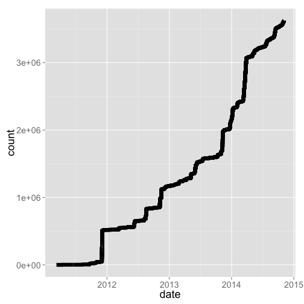 

#### BEF 


```r
bef %>% sort_count %>% gp
```

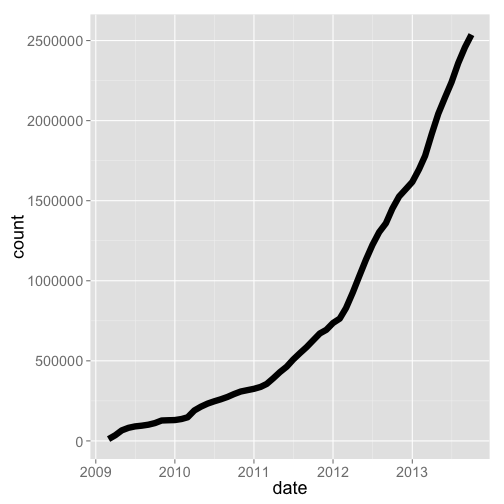 

#### OpenSNP


```r
opensnp_genotypes <- opensnp_genotypes %>% mutate(type = "genotyptes") %>% sort_count
opensnp_phenotypes <- opensnp_phenotypes %>% mutate(type = "phenotyptes") %>% sort_count
opensnp_snps <- opensnp_snps %>% mutate(type = "snps") %>% sort_count
opensnp_users <- opensnp_users %>% mutate(type = "users") %>% sort_count
os_all <- rbind(opensnp_genotypes, opensnp_phenotypes, opensnp_snps, opensnp_users)
os_all %>%
  ggplot(aes(date, log10(count), color=type)) + 
    geom_line() + 
    theme_grey(base_size = 18)
```

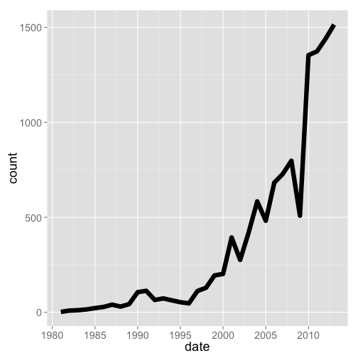 

#### Datacite


```r
dcite %>% sort_count %>% gp
```

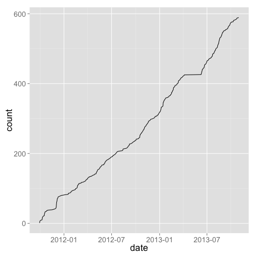 

### Visualize, counts summarised previously by data provider

#### US National Phenology Network


```r
npn %>% arrange(date) %>% rename(count = Number_Records) %>% gp
```

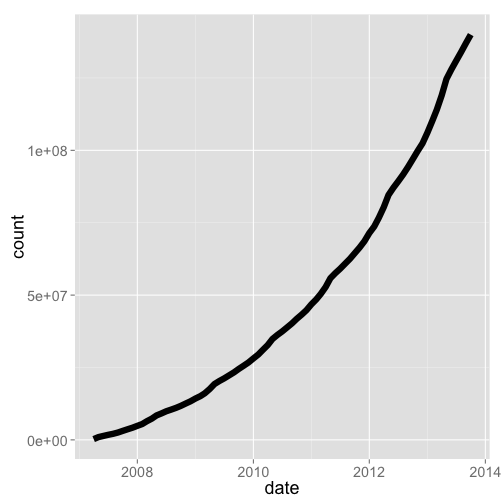 

#### TreeBASE


```r
treebase %>% arrange(date) %>% rename(count = New.Trees.Added) %>% gp
```

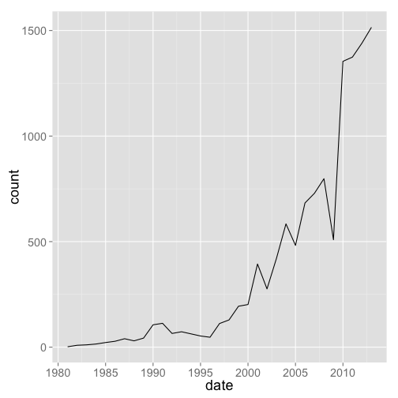 

#### ITIS


```r
itis %>% arrange(date) %>% rename(count = total_names) %>% gp
```

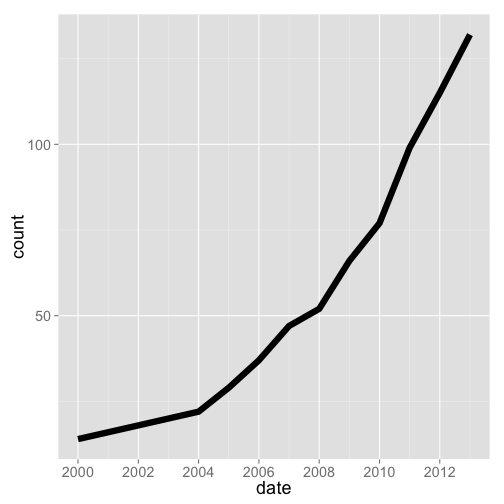 

#### eBird


```r
ebird_observations %>% arrange(date) %>% rename(count = COUNT.OBS_ID.) %>% gp
```

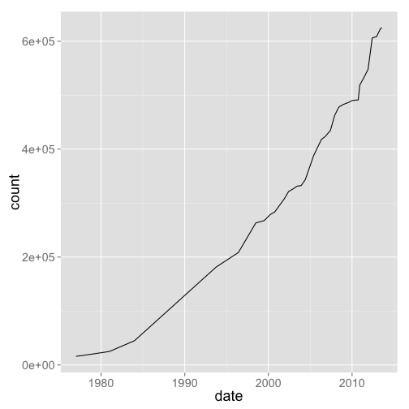 

#### Catalogue of Life

Number of species


```r
col %>% arrange(date) %>% rename(count = species) %>% gp
```

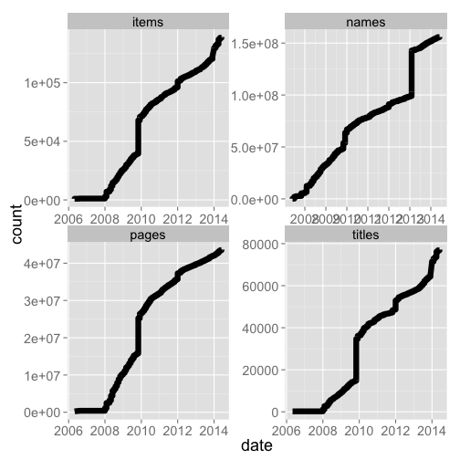 

Number of data sources


```r
col %>% arrange(date) %>% rename(count = source_databases) %>% gp
```

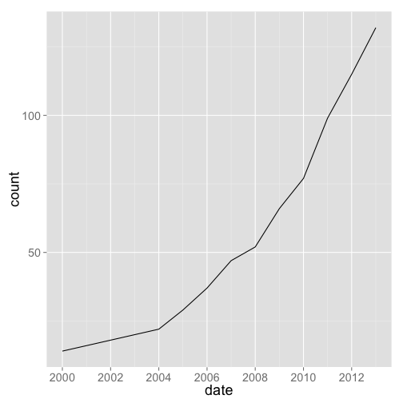 

#### Biodiversity Heritage Library


```r
bhl_titles <- bhl_titles %>% mutate(type = "titles") %>% arrange(date) %>% mutate(count = cumsum(Titles))
bhl_items <- bhl_items %>% mutate(type = "items") %>% arrange(date) %>%  mutate(count = cumsum(Items))
bhl_pages <- bhl_pages %>% mutate(type = "pages") %>% arrange(date) %>%  mutate(count = cumsum(Pages))
bhl_names <- bhl_names %>% mutate(type = "names") %>% arrange(date) %>%  mutate(count = cumsum(Names))
bhl_all <- rbind(bhl_titles[,-c(1:4)], bhl_items[,-c(1:4)], bhl_pages[,-c(1:4)], bhl_names[,-c(1:4)])
bhl_all %>%
  ggplot(aes(date, count, color=type)) + 
    geom_line() + 
    theme_grey(base_size = 18)
```

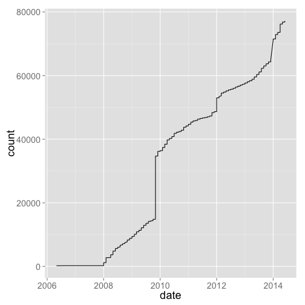 

#### GBIF

Number of records


```r
gbif_data %>%
  arrange(date) %>%
  rename(count = V2) %>%
  gp + labs(y="Millions of biodiversity records in GBIF")
```

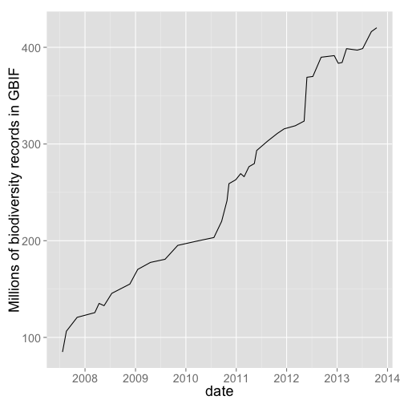 

Number of data publishers


```r
gbif_publishers %>%
  arrange(date) %>%
  rename(count = V2) %>%
  gp + labs(y="Number of GBIF data publishers")
```

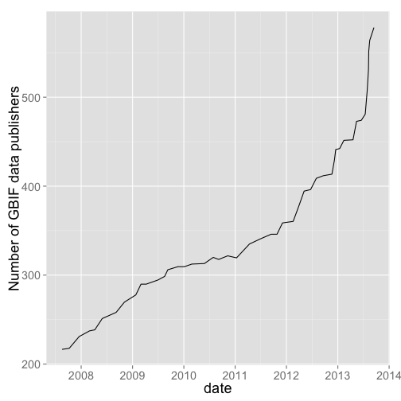 

#### Neotoma


```r
rbind(neotoma_data %>% mutate(type = "data") %>% arrange(date),
      neotoma_datasets %>% mutate(type = "datasets") %>% arrange(date),
      neotoma_taxa %>% mutate(type = "taxa") %>% arrange(date)) %>%
  rename(count = RunningCount) %>%
  gp + facet_grid(type ~ ., scales="free")
```

 

## Gaps in open data

This is more of a qualitative judgment, but ...

## Reproduce this

* Option 1: If you are comfortable with git, simply clone the [dbgrowth repository](https://github.com/ropensci/dbgrowth) to your machine, uncompress the compressed file, `cd` to the directory, and run `R`. Running R should enter _packrat mode_, which will install packages from within the directory, after which point you can reproduce what we have done above.
* Option 2: Install the `packrat` R package if you don't have it already. Download the compressed file (a _packrat bundle_), then in R, run `packrat::unbundle("<path to tar.gz>", "<path to put the contents>")`, which will uncompress the file, and install packages, and you're ready to go.
